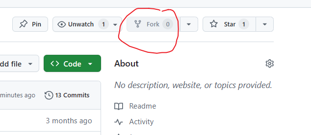
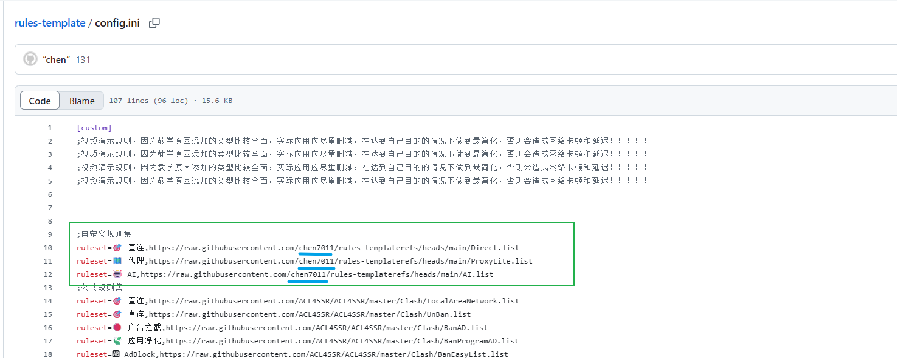
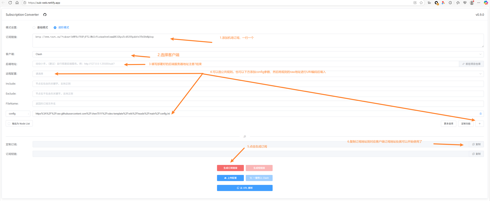

# rules-template

- ### 项目简介

  - 平时使用代理配置时候会将规则写入本地软件配置里。会出现一些问题。例如，不同客户端无法共用分流规则（singbox的分流配置无法放到clash中使用），修改一个客户端无法同步另外一个客户端，（修改手机singbox分流规则。PC的clash无法同步）等问题。为了解决这类问题，可以写一份分流规则模板放代码托管平台托管。然后配合订阅转换服务将模板转换成不同客户端的配置。

- ### 使用教程：

  1. #### 配置克隆和修改

     - 无自定义规则：

       - 如果没有自定义规则需求，只想使用公共规则科学上网，可以使用此仓库的规则配置模板，地址：

       - ```
         https://raw.githubusercontent.com/chen7011/rules-template/refs/heads/main/config.ini
         ```

     - 自定义规则：

       1. 先fork一份项目到自己仓库。后续规则修改都在自己仓库进行：
          - 
       2. 修改自定义规则的指向地址：
          - config.ini文件中的绿色方框中地址的蓝色下划线的用户名换成自己github账号的用户名。使其指向自己fork的仓库
          - 
          - 后续如果需要添加直连

  2. #### 订阅转换服务安装：

     - 因为网上公开的订阅转换存在机场被盗用的风险，所以推荐自建一个本地的订阅转换服务。

     - 参考文档：

       - [https://github.com/tindy2013/subconverter]: 	"支持clash ss ssr V2Ray等客户端转换"
         [https://github.com/asdlokj1qpi233/subconverter]: 	"推荐！在前一个转换服务的基础上添加singbox，Surge 5的支持"

     - 这里通过docker使用asdlokj1qpi233/subconverter项目安装订阅转换服务：

       - 部署好后浏览器访问：

         http://[ip]:25500/version

         ,可以打印出版本信息表示部署成功，安装命令：

       - ```
         docker run --name=subconverter -d --restart=unless-stopped --memory=1024m -e TZ=Asia/Shanghai -p 25500:25500 asdlokj1qpi23/subconverter:latest
         ```

  3. #### 拼接订阅地址：

    - 如果需要前端UI界面可以参考，这里不做演示：

      前端UI:https://github.com/CareyWang/sub-web

    - 现成前端：https://sub-web.netlify.app/  

          - uri编码地址：[URL Encode and Decode - Online](https://www.urlencoder.org/)

        具体步骤：

        

    - 通过2步骤你已经成功部署好了订阅转换服务，接下来就可以拼接参数来获取订阅地址了：

      - 订阅转换服务的地址,{ip}需要替换成你自己部署机器的IP，http://{ip}:25500/sub

      - 参数拼接参考，将其中的config参数换成raw地址即可

        ```
        https://raw.githubusercontent.com/chen7011/rules-template/refs/heads/main/config.ini
        ```

        - []: https://github.com/tindy2013/subconverter

  4. #### openclash使用参考：

     1. 
     2. 