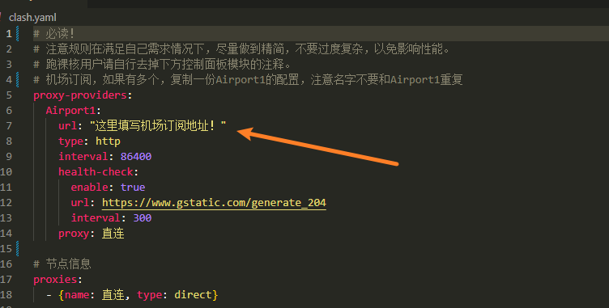
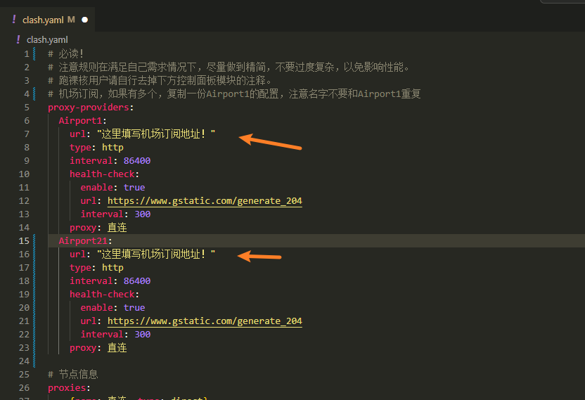
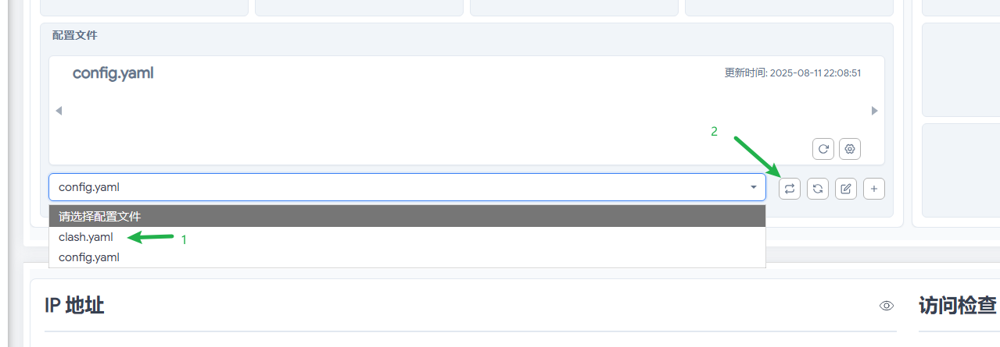
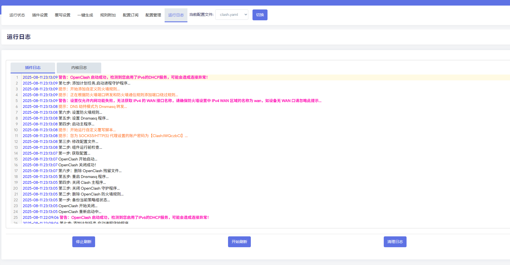
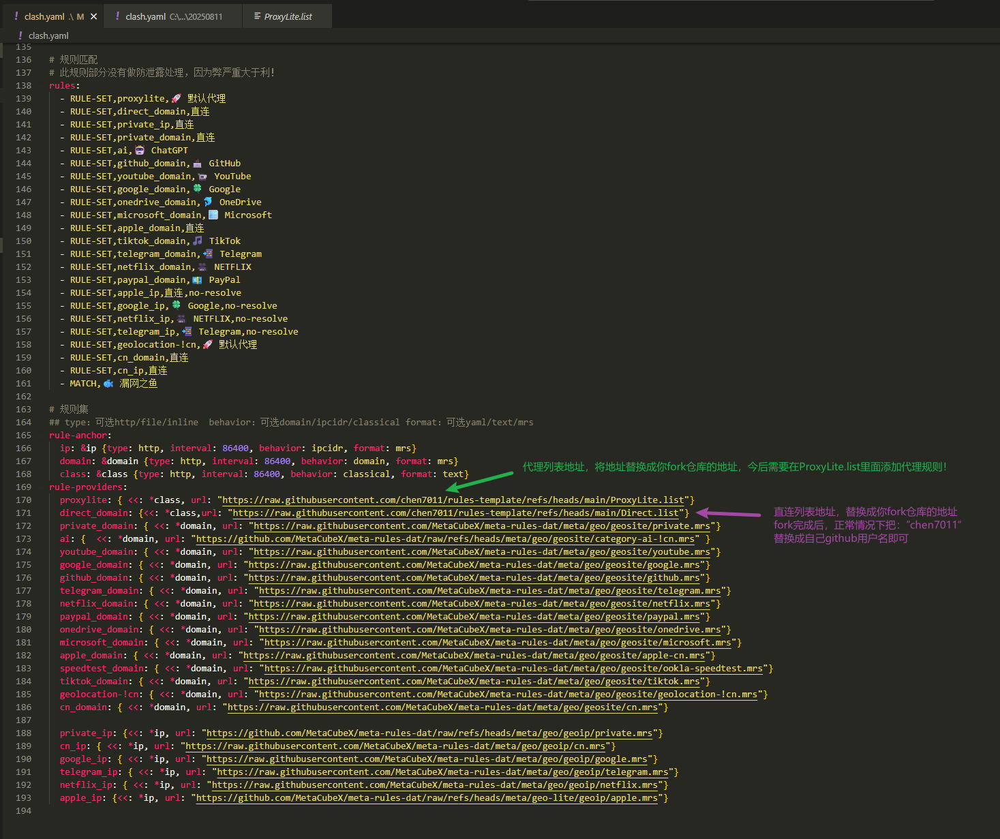
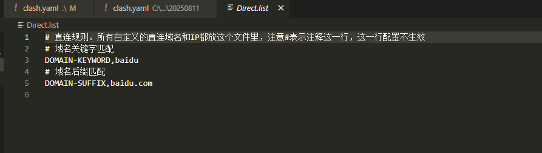

# clash-configs

- ### 项目简介

  - clash开箱即用配置，可直接添加机场使用，如果不熟练yaml语法可以参考： https://zh.wikipedia.org/wiki/YAML#%E8%AA%9E%E6%B3%95 

- ### 使用教程：

  1. #### 无自定义规则需求

     1. 下载一键配置文件，开启命令窗口下载配置到本地：

        ```shell
        curl https://raw.githubusercontent.com/chen7011/rules-template/refs/heads/main/clash.yaml > clash.yaml
        ```

        2. 添加机场订阅：如果有多个机场多复制几份Airport1，Airport1是机场名字可以随意取。多个机场注意不要重复

            1. 

        3. 多个机场示例，如果只有一个机场无视这一步：

            1. 

        4. 保存配置，上传到clash，切换配置，就可以点击启用。

            1. 
            2. 
            3. 查看日志无报错就可以开始留学生涯了
                1. 

  2. ### **有自定义规则需求**

     1. 如果平时有自定义代理规则和直连规则需求。可将仓库fork一份，然后在原来clash.yaml的基础上修改以下内容

        1. 

        2. 这两个地址指向"ProxyLite.list"和"Direct.list"两个文件,fork目的就是提供给自己维护，今后只要往"ProxyLite.list" 文件里添加规则就走默认代理，"Direct.list"文件里添加救走直连。具体规则语法参考：

           [规则语法]: https://wiki.metacubex.one/config/

           1. 
           2. 

        3. 其他步骤参考：1.无自定义规则需求

