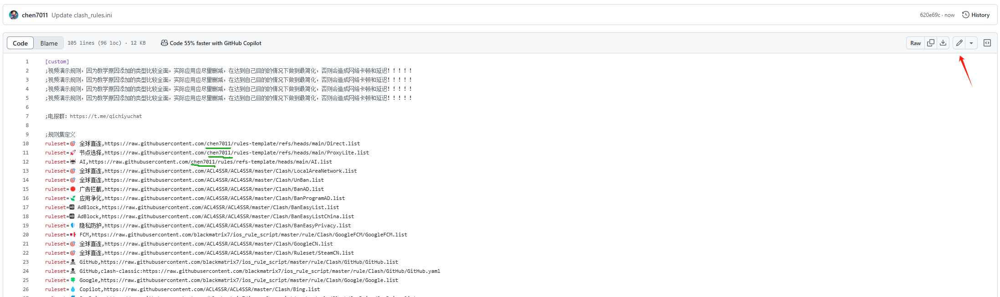
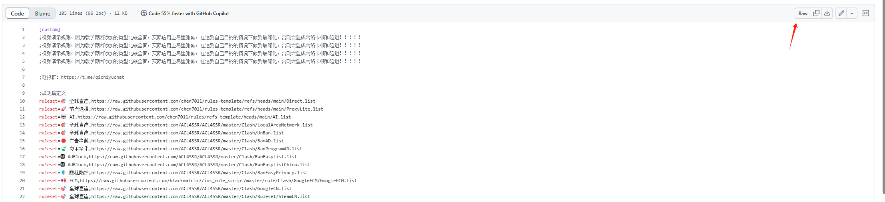
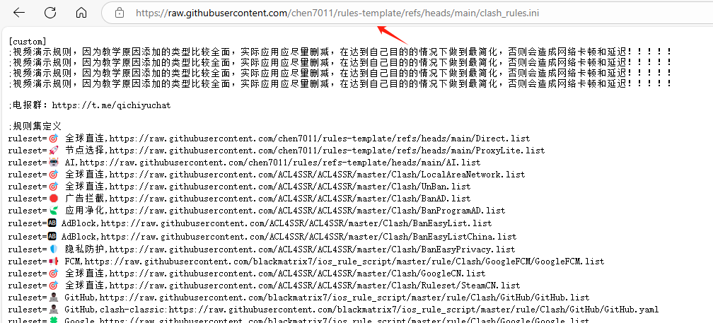
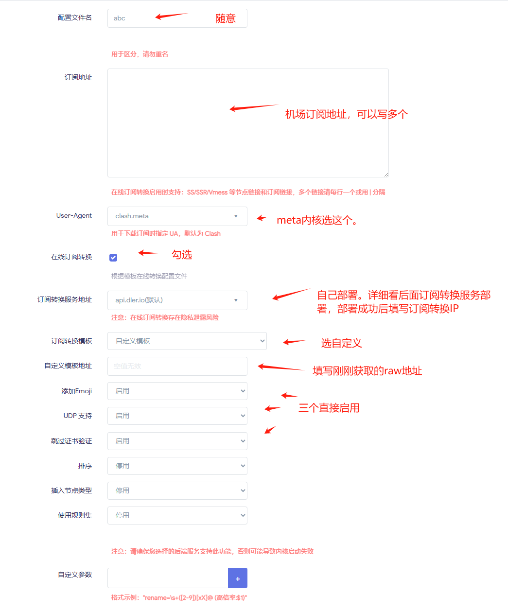

# rules-template

- 订阅转换模板。将机场订阅通过模板定义的分流分组规则转换成代理软件可执行的配置文件。

- 下面以openwrt的clash为例：

  - 订阅转换部署：

    ​	使用dockers：

    ```
    docker run --name=subconverter -d --restart=unless-stopped --memory=1024m -e TZ=Asia/Shanghai -p 25500:25500 asdlokj1qpi23/subconverter:latest
    ```

       部署成功后访问 http://主机IP:端口/version   ，如果有出现版本号表示部署成功。

      订阅转换服务器转换地址为：http://主机IP:端口/sub 

  - 先fork一份本项目，进入到fork的项目后进入自己项目里开始编辑clash_rules.ini文件，将绿色下划线替换成自己github的用户名，来指向自己仓库的规则。

    - 

  - 点击软路由openclash插件，进入到订阅配置中

  - 

  - 新建一个配置

  - 获取配置只读地址：

  - 

    - 点击raw打开后跳转一个新标签。复制标签地址
    - 

  - 修改配置：

    - 

      ​	保存配置。并且应用配置就生效了

    